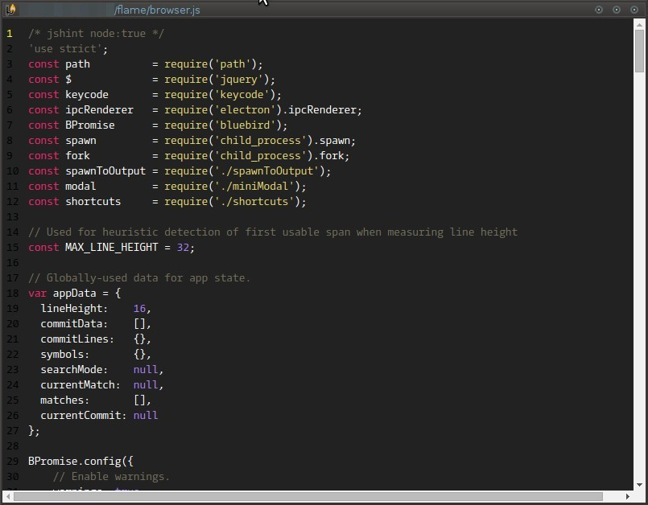
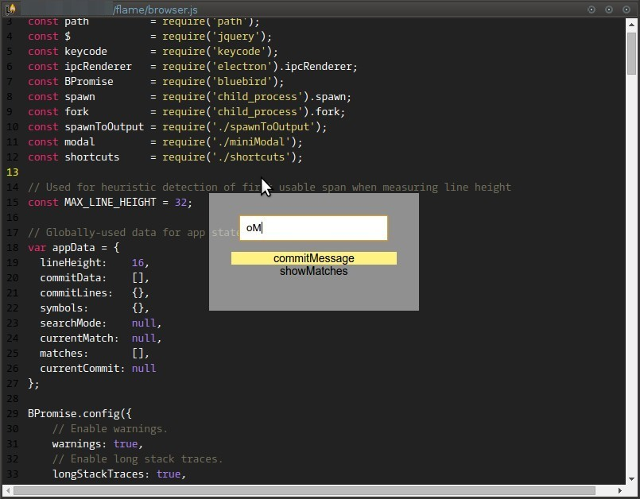
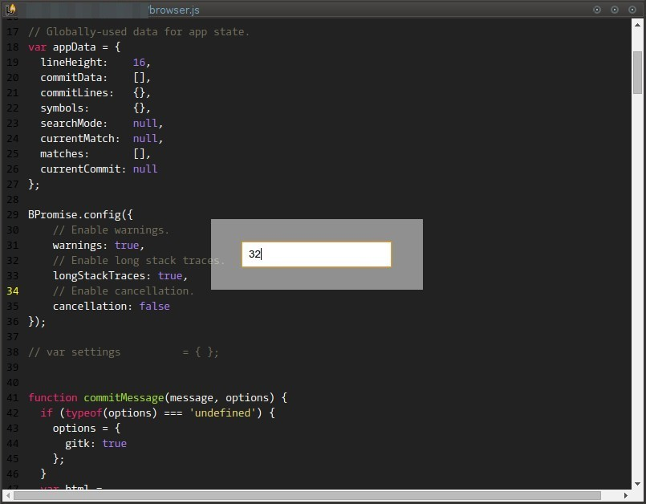
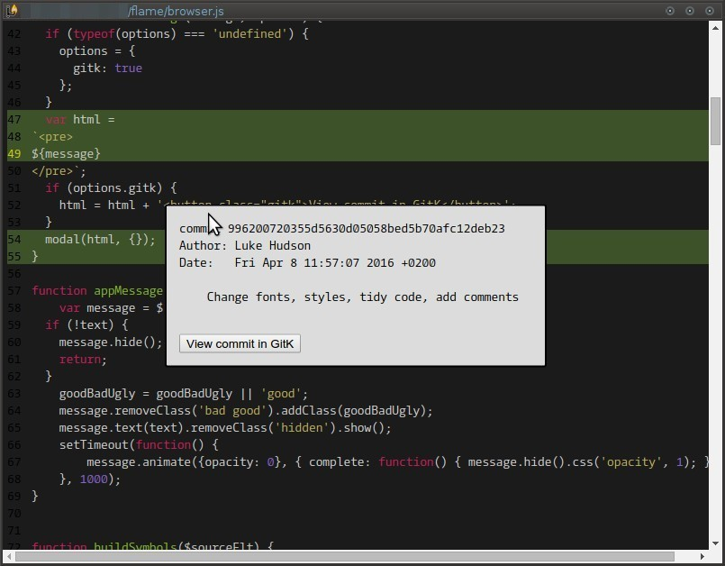

# Flame
## A prettier git blame

This is a small (in concept, not size) app that functions similiarly to `git gui blame`, but with syntax highlighting
and a simpler UI.

## Features

- Syntax highlighting for many languages (courtesy of [highlight.js](https://highlightjs.org/download/))
- Jump to commit in log (requires GitK)
- Function search (depending on language)

## Screenshots
### Initial view

### Ctrl+R function search

### Ctrl+G goto line

### Click on a line to show commit info



## Build

```bash
git clone https://github.com/lingo/flame.git
cd flame
npm install
gulp
```

## Usage

`flame path/to/file`
